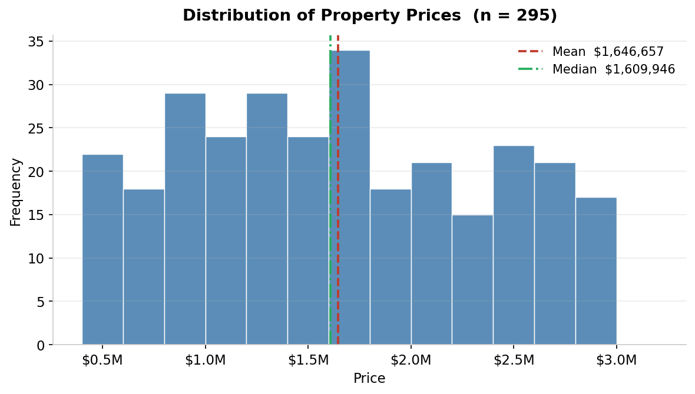
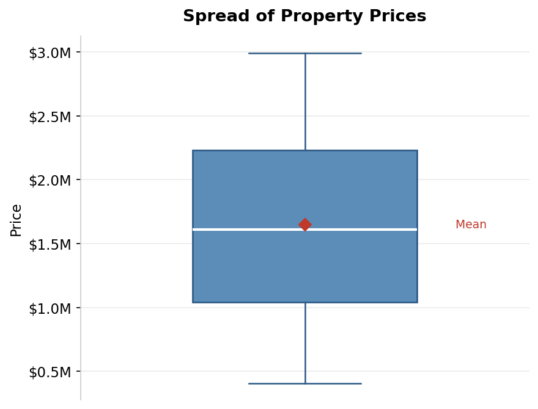
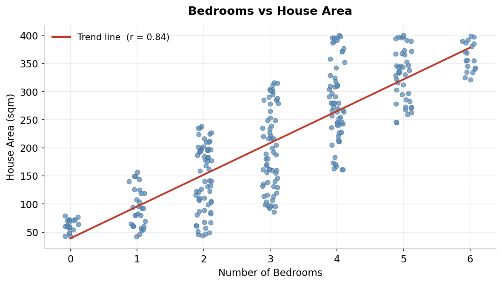
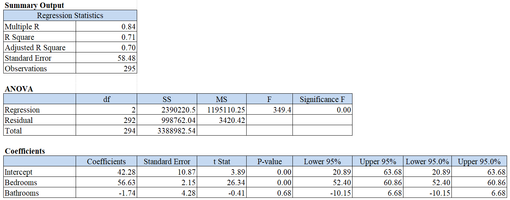
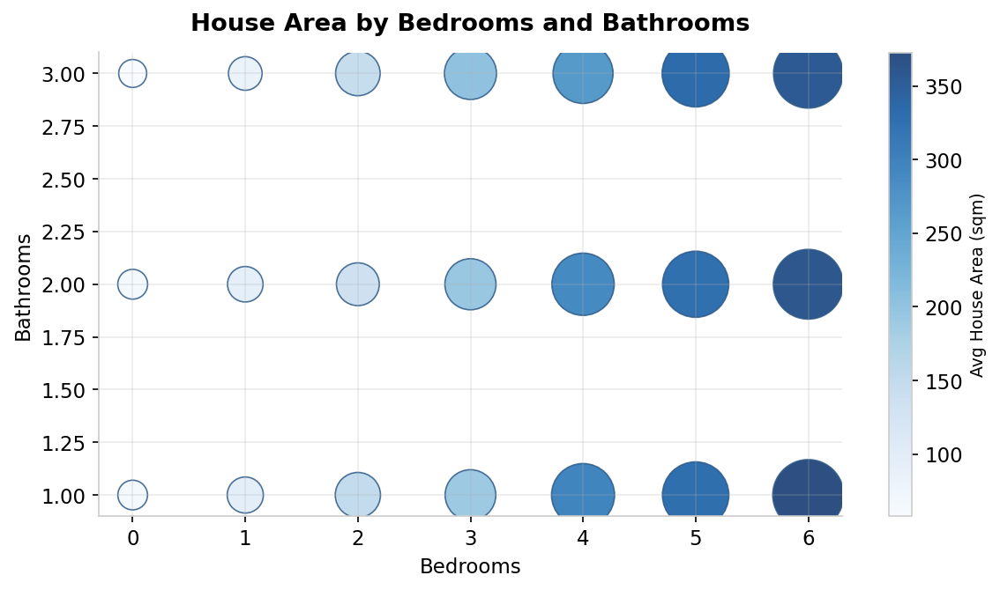
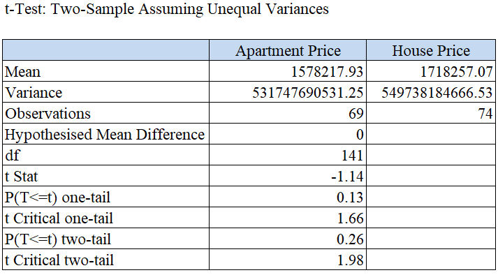
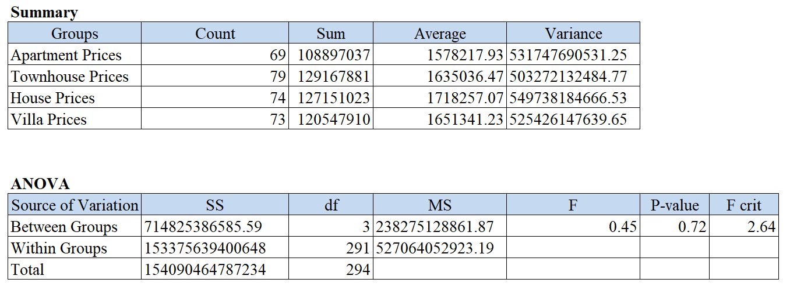

# Sydney Property Sales Analysis in Microsoft Excel

End to end statistical analysis of a 3,000 record Sydney residential property sales dataset, built entirely in Microsoft Excel. The project covers data cleaning, lookup functions, descriptive statistics, hypothesis testing, correlation, regression, and the Data Analysis ToolPak (two sample t-test and one way ANOVA).

**Author:** Huynh Thien Luan (Ethan) Dang <br>
**Unit:** BUSA6004 Introduction to Inference, Modelling, and Forecasting, Macquarie University <br>
**Tools:** Microsoft Excel (formulas, charts, Data Analysis ToolPak) <br>

---

## Key findings

- **Prices are right skewed.** Across the 295 row cleaned subset the mean sale price ($1,646,657) sits above the median ($1,609,946), a signature of a small number of high value sales pulling the average up. The coefficient of variation of 0.44 confirms substantial relative spread.
- **Bedrooms strongly predict house size.** Bedrooms and house area correlate at r = 0.84, significant at the 5% level (t = 26.47 against a critical value of 1.65). Bedroom count is a reliable proxy for floor area.
- **Bedrooms drive area, bathrooms do not.** A multiple regression of house area on bedrooms and bathrooms explains 71% of the variation (R-squared = 0.71). Each additional bedroom adds about 57 sqm (p < 0.001), while bathrooms are not significant (p = 0.68).
- **Property type does not separate price.** Neither a two sample t-test (apartments vs houses, p = 0.26) nor a one way ANOVA across all four types (p = 0.72) found a significant price difference. Within group variability is large enough that headline mean gaps are consistent with random sampling.

---

## Skills demonstrated

| Capability | How it shows up here |
|---|---|
| Data cleaning and validation | Filtered a 295 to 300 row partition, identified and removed five invalid records using logical checks on range and data type |
| Lookup and data matching | Populated council areas with both VLOOKUP and XLOOKUP, then cross validated the two columns for agreement |
| Descriptive statistics | Mean, median, mode, range, IQR, variance, standard deviation, and coefficient of variation using native Excel functions |
| Data visualisation | Histogram, box and whisker plot, scatter plot, and bubble chart with deliberate axis choices |
| Hypothesis testing | Full Z-test and t-test workflows with stated hypotheses, test statistics, critical values, and decision rules |
| Correlation analysis | Pearson correlation with a significance test and supporting scatter plot |
| Regression modelling | Multiple linear regression with coefficient interpretation, significance, and goodness of fit commentary |
| Excel Data Analysis ToolPak | Two sample t-test assuming unequal variances and single factor ANOVA |
| Business communication | Plain language interpretation of every result for a non technical property developer audience |

---

## Analysis walkthrough

### 1. Data cleaning
Filtered the dataset to the assigned partition and removed five records that failed validation: a negative bedroom count, a placeholder agent name, a dessert in the Property Type field, a construction year in the future, and a property with zero land size. Full detail in the [report](report/report.pdf).

### 2. Lookup functions
Filled the council area for each suburb twice, once with VLOOKUP and once with XLOOKUP, then confirmed the two columns matched. This demonstrates both the legacy and modern Excel lookup approaches and a habit of cross checking results.

### 3. Descriptive statistics for Price
Computed centre and spread, then visualised both. The histogram shows the concentration of sales in the lower to middle price bands with a thinner upper tail. The box plot shows the central 50% of sales spanning roughly $1.0M to $2.2M.





### 4. Hypothesis test on villa prices
Tested whether mean villa price exceeds $1.675M using a Z-test on 725 villas. The test statistic of 0.42 falls well below the 1.645 critical value, so there is not enough evidence to conclude villas sell for more than $1.675M on average.

### 5. Correlation: bedrooms and house area
Correlation of r = 0.84 with a t-statistic of 26.47, far above the 1.65 critical value. The relationship is positive and highly significant: larger bedroom counts go with larger floor areas.



### 6. Regression: house area on bedrooms and bathrooms

House Area = 42.28 + 56.63 x Bedrooms - 1.74 x Bathrooms

Each bedroom adds about 57 sqm and is highly significant (p < 0.001). Bathrooms are not significant once bedrooms are accounted for (p = 0.68). The model explains 71% of the variation in house area.





### 7. Two sample t-test: apartments vs houses
Two sample t-test assuming unequal variances via the Data Analysis ToolPak. The two tailed p-value of 0.26 means there is no significant difference in mean price between apartments and houses, despite houses showing a higher raw mean.



### 8. ANOVA across all four property types
Single factor ANOVA comparing apartment, townhouse, house, and villa prices. The p-value of 0.72 means we cannot reject equal means: property type alone does not explain the variation in price.



---

## Repository structure

```
busa6004-property-sales-excel-analysis/
├── README.md
├── workbook/
│   └── property_sales_analysis.xlsx     Full Excel workbook (all questions, formulas, charts)
├── report/
│   └── report.pdf                       Written report with annotated formulas and interpretation
├── figures/                             Charts and Data Analysis ToolPak output
└── data/
    └── DATA_DICTIONARY.md               Column definitions and cleaning notes
```

## How to explore

Open `workbook/property_sales_analysis.xlsx` to inspect every formula and chart across the question tabs, or read `report/report.pdf` for the full written analysis with interpretation. The figures in this README are clean reproductions of the workbook outputs alongside the original ToolPak result tables.
